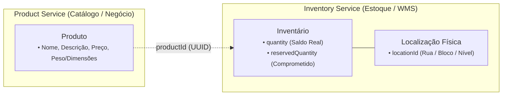
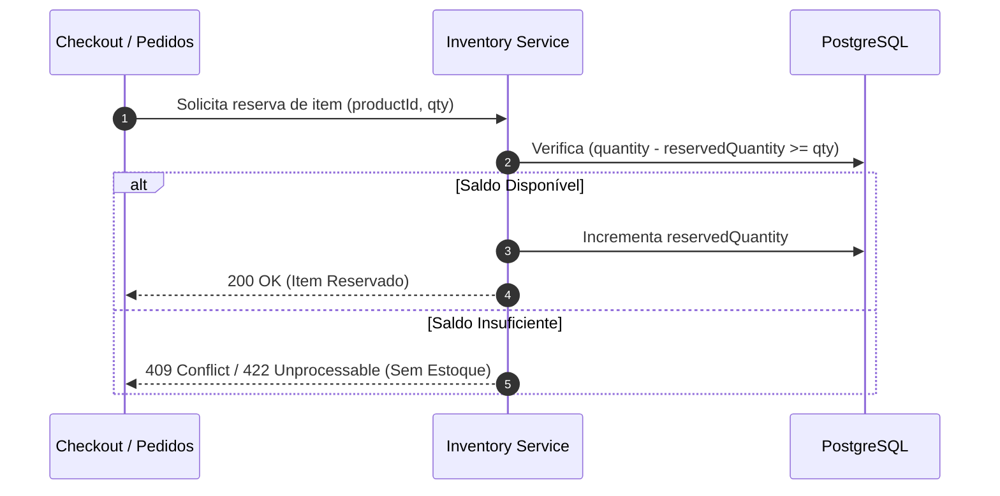
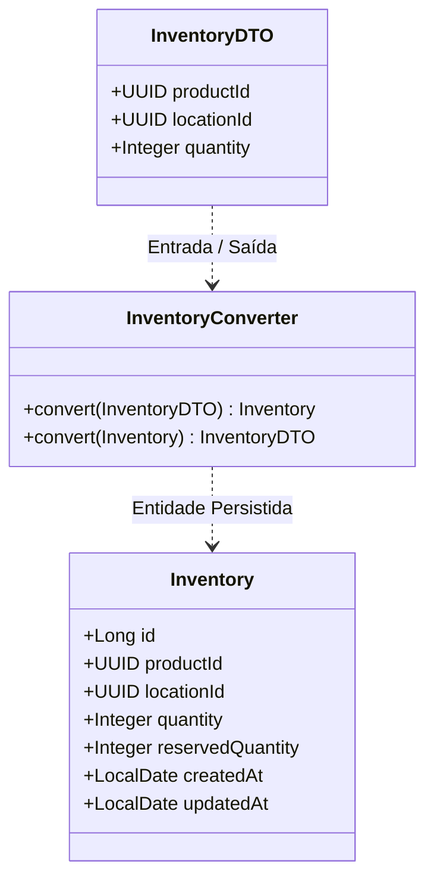

# Inventory Service

> Microsserviço de alta performance responsável pelo gerenciamento de inventário, controle de saldos físicos e endereçamento logístico de produtos.

---

## 📌 Sumário

- [Visão Geral](#-visão-geral)
- [Arquitetura & Decisões Técnicas](#-arquitetura--decisões-técnicas)
  - [Separação de Responsabilidades (Bounded Contexts)](#separação-de-responsabilidades-bounded-contexts)
  - [Endereçamento Físico (WMS - Warehouse Management)](#endereçamento-físico-wms---warehouse-management)
  - [Garantia de Fluxos de Estoque (Entradas, Saídas e Reservas)](#garantia-de-fluxos-de-estoque-entradas-saídas-e-reservas)
- [Modelagem de Dados](#-modelagem-de-dados)
- [Tecnologias Utilizadas](#-tecnologias-utilizadas)
- [Estrutura do Projeto](#-estrutura-do-projeto)
- [Como Executar](#-como-executar)
- [Exemplos de Requisição](#-exemplos-de-requisição)
- [Próximos Passos](#-próximos-passos)

---

## 🎯 Visão Geral

O **Inventory Service** foi desenhado sob os princípios de **Domain-Driven Design (DDD)** para atuar de forma isolada e autônoma na gestão quantitativa e física de itens de estoque.

Ele não atua como catálogo comercial, mas sim como a autoridade transacional sobre **onde** cada item está alocado e **quanto** desse item está disponível ou reservado.

---

## 🏗️ Arquitetura & Decisões Técnicas

### Separação de Responsabilidades (Bounded Contexts)

Uma decisão arquitetural central deste serviço é o **baixo acoplamento** com o ecossistema de produtos:

- **Product Service (Catálogo)**: Mantém os dados cadastrais e mercadológicos do produto (nome, descrição, dimensões, peso, preço, categorias, marca).
- **Inventory Service (Estoque)**: Guarda exclusivamente a referência unívoca (`productId: UUID`), a quantidade em estoque e a localização no galpão.

> **Por que adotar essa separação?**
> 1. **Independência de Domínio**: Alterações de catálogo (ex: mudança de nome, preço promocional ou descrição) não impactam nem invalidam o estoque.
> 2. **Performance e Concorrência**: Operações de inventário sofrem alta concorrência de leitura e escrita (checkout de compras, reposição física). Manter o registro magro reduz locks de banco de dados e overhead transacional.
> 3. **Consistência Eventual**: Futuramente, a comunicação entre o catálogo e o inventário poderá ocorrer de forma assíncrona (via mensageria/RabbitMQ/Kafka) ou síncrona sob demanda via REST.



---

### Endereçamento Físico (WMS - Warehouse Management)

Cada registro de inventário conecta o produto a uma localização no armazém por meio do `locationId: UUID`.

Em uma operação logística real, esse identificador representa o endereço físico do item seguindo a convenção padrão de WMS:
- **Rua** (Corredor): ex. `141`
- **Bloco** (Módulo/Prateleira): ex. `2`
- **Nível** (Altura/Andar): ex. `1`

*(Exemplo de endereço no galpão: `141 2 1` -> Rua 141, Bloco 2, Nível 1)*

Isso possibilita que o mesmo `productId` exista em múltiplos pontos do armazém (armazenamento descentralizado, picking vs. pulmão).

---

### Garantia de Fluxos de Estoque (Entradas, Saídas e Reservas)

O microsserviço é o guardião das seguintes operações críticas:

1. **Entrada (Inbound / Reposição)**: Incremento do saldo físico (`quantity`) mediante recebimento de mercadorias ou devoluções.
2. **Reserva (Hold / Checkout)**: Alocação temporária em `reservedQuantity` enquanto uma ordem de compra aguarda pagamento, impedindo *overselling* (venda dupla do mesmo item).
3. **Saída (Outbound / Picking & Packing)**: Baixa definitiva do saldo físico e do saldo reservado após confirmação do envio.



---

## 📊 Modelagem de Dados

### Diagrama de Classes e Mapeamento



---

## 🛠️ Tecnologias Utilizadas

- **Java 17**
- **Spring Boot 4.x** (WebMVC, Data JPA, Validation, Actuator)
- **PostgreSQL 18** (Executado via Docker Compose)
- **Flyway** (Migrations e versionamento do banco de dados)
- **Lombok** (Produtividade e redução de boilerplate)
- **Jakarta Bean Validation** (Garantia de integridade nos payloads de entrada)

---

## 📁 Estrutura do Projeto

```text
src/main/java/com/lazaro/inventory/
├── business/        # Regras de negócio e orquestração de serviços
│   └── InventoryBusiness.java
├── controller/      # Endpoints HTTP / REST Controllers
│   └── InventoryController.java
├── inventory/       # Entidades JPA, Records DTO e Repositories
│   ├── Inventory.java
│   ├── InventoryDTO.java
│   └── InventoryRepository.java
└── util/            # Conversores, mappers e classes utilitárias
    └── InventoryConverter.java
```

---

## 🚀 Como Executar

### Pré-requisitos
- Docker e Docker Compose instalados.
- Java 17 e Maven (ou use o wrapper/mvn local).
- Make (opcional, mas recomendado).

### 1. Subir o Banco de Dados PostgreSQL
Suba a infraestrutura local em background:
```bash
make bd
# ou: docker compose up -d
```

Para acompanhar os logs do banco:
```bash
make logs
# ou: docker compose logs -f db
```

### 2. Configurar o Ambiente
Copie as variáveis de ambiente base:
```bash
cp .env.example .env
```

### 3. Executar o Microsserviço
```bash
make run
# ou: mvn spring-boot:run
```

---

## 📡 Exemplos de Requisição

### Criar Registro de Inventário

- **Endpoint**: `POST /inventory`
- **Headers**: `Content-Type: application/json`

```bash
curl -X POST http://localhost:8080/inventory \
  -H "Content-Type: application/json" \
  -d '{
    "productId": "a1b2c3d4-e5f6-7a8b-9c0d-1e2f3a4b5c6d",
    "locationId": "f9e8d7c6-b5a4-3f2e-1d0c-9b8a7f6e5d4c",
    "quantity": 150
  }'
```

---

## 🔜 Próximos Passos

- [ ] Ajustar status HTTP do endpoint de criação para `201 Created`.
- [ ] Implementar migrations via Flyway para a criação segura da tabela `inventory`.
- [ ] Adicionar auditoria automática de data (`@CreatedDate`, `@LastModifiedDate`).
- [ ] Desenvolver operações de reserva (`hold`) e movimentação de estoque (`inbound` e `outbound`).
